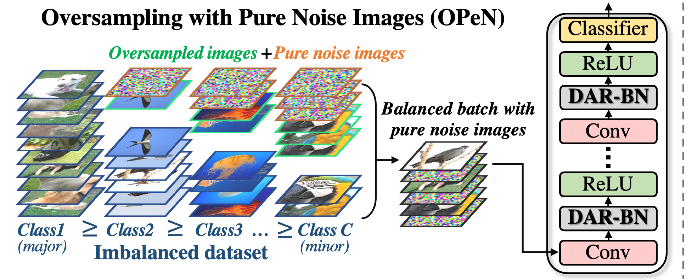
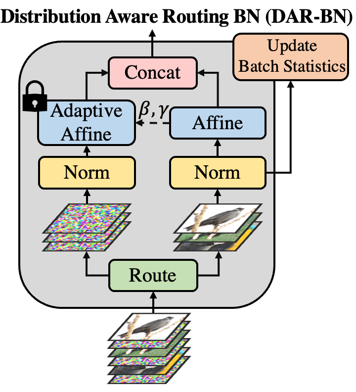

# Pure Noise to the Rescue of Insufficient Data: Improving Imbalanced Classification by Training on Random Noise Images

  
  

 

> **Pure Noise to the Rescue of Insufficient Data: Improving Imbalanced Classification by Training on Random Noise Images**
>
> Shiran Zada, Itay Benou, Michal Irani
>
> Abstract: Despite remarkable progress on visual recognition tasks, deep neural-nets still struggle to generalize well when training data is scarce or highly imbalanced, rendering them extremely vulnerable to real-world examples. In this paper, we present a surprisingly simple yet highly effective method to mitigate this limitation: using pure noise images as additional training data. Unlike the common use of additive noise or adversarial noise for data augmentation, we propose an entirely different perspective by directly training on pure random noise images. We present a new Distribution-Aware Routing Batch Normalization layer (DAR-BN), which enables training on pure noise images in addition to natural images within the same network. This encourages generalization and suppresses overfitting. Our proposed method significantly improves imbalanced classification performance, obtaining state-of-the-art
results on a large variety of long-tailed image classification datasets (CIFAR-10-LT, CIFAR-100-LT, ImageNet-LT, Places-LT, and CelebA-5). Furthermore, our method is extremely simple and easy to use as a general new augmentation tool (on top of existing augmentations), and can be incorporated in any training scheme. It does not require any specialized data generation or training procedures, thus keeping training fast and efficient.

# Code
The code will be released in this repository soon.
